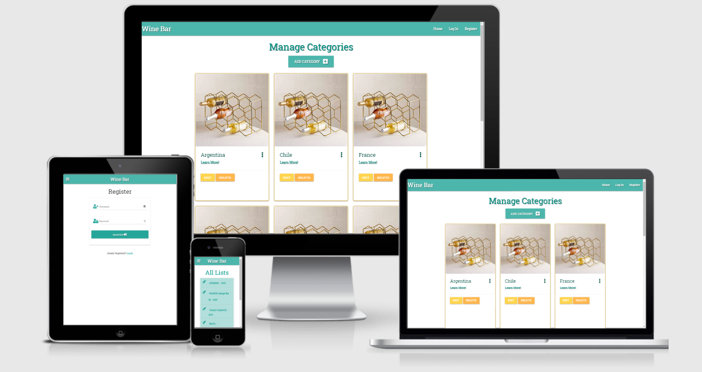
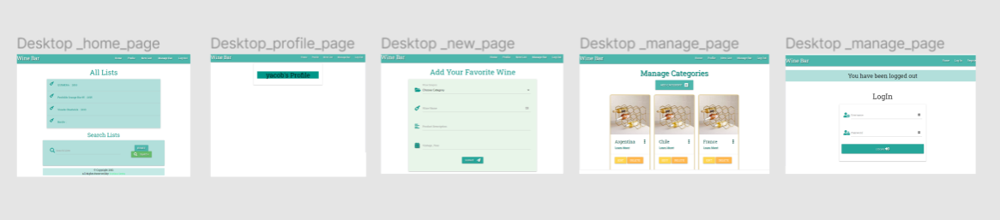
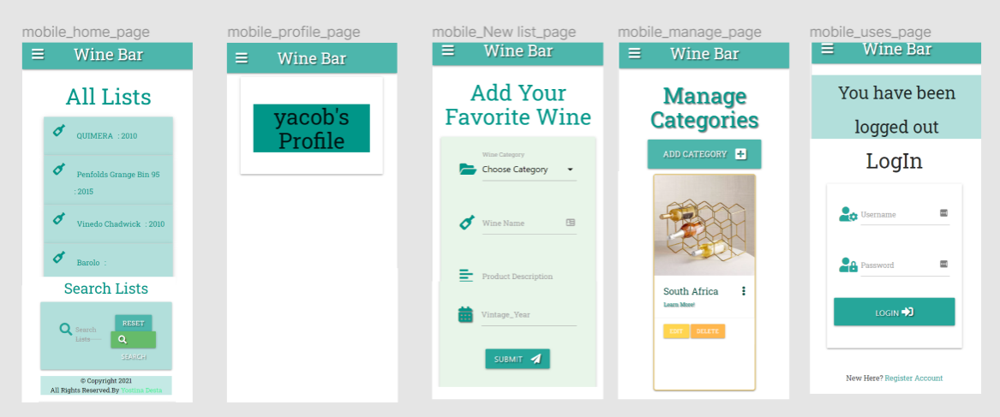
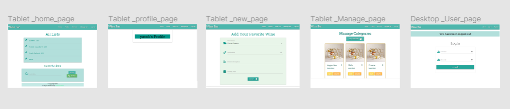

# Wine Bar

## Third Milestone Project

## Code Institute / Data Centric Development

Wine Bar is an online Bar , where the user can manage catagory, add, edit and delete lists. 1. This wine bar is very friendly because this wine bar app classification can be done according to various methods, including place of origin or appellation and vintage, or variety used. Make sure that to add your favorite wine and enjoy that kind of wine experience. 

## Table of Contents

1. [UX](https://github.com/YOSTINA-dh/Wine-Bar-app#ux)
    - [Project Goals](https://github.com/YOSTINA-dh/Wine-Bar-app#project-goals)
    - [User Stories](https://github.com/YOSTINA-dh/Wine-Bar-app#user-stories)
    - [Developer Goals](https://github.com/YOSTINA-dh/Wine-Bar-app#developer-goals)
    - [Design](https://github.com/YOSTINA-dh/Wine-Bar-app#design)
        - [Color Scheme](https://github.com/YOSTINA-dh/Wine-Bar-app#color-scheme)
        - [Fonts](https://github.com/YOSTINA-dh/Wine-Bar-app#fonts)
        - [Wireframes](https://github.com/YOSTINA-dh/Wine-Bar-app#wireframes)
2. [Features](https://github.com/YOSTINA-dh/Wine-Bar-app#features)
    - [Existing Features](https://github.com/YOSTINA-dh/Wine-Bar-app#existing-features)
    - [Features Left to Implement](https://github.com/YOSTINA-dh/Wine-Bar-app#features-left-to-implement)
3. [Testing](https://github.com/YOSTINA-dh/Wine-Bar-app#testing)
4. [Deployment](https://github.com/YOSTINA-dh/Wine-Bar-app#deployment)
    - [How to deploy the site](https://github.com/YOSTINA-dh/Wine-Bar-app#how-to-deploy-the-site)
    - [How to deploy locally](https://github.com/YOSTINA-dh/Wine-Bar-app#how-to-deploy-locally)
5. [Technologies Used](https://github.com/YOSTINA-dh/Wine-Bar-app#technologies-used)
6. [Credits](https://github.com/YOSTINA-dh/Wine-Bar-app#credits)
    - [Content](https://github.com/YOSTINA-dh/Wine-Bar-app#content)
    - [Media](https://github.com/YOSTINA-dh/Wine-Bar-app#media)
    - [Code](https://github.com/YOSTINA-dh/Wine-Bar-app#code)
    - [Acknowledgements](pip)

## UX

### Project Goals

Wine Bar is part of my Code Institute Full Stack Software Development studies, the Data-Centric Development module. The scope for this milestone project is to "Create a web application that allows users to store and easily access wine bar lists," using the CRUD operations of Create, Read, Update, and Delete for their wine lists.
This wine bar is for people who are enjoying wine tasting and hosting their own wine tasting party. A wine tasting party is a perfect way to explore new varieties of wine, from the French Loire Valley to the depths of South Africa,  and this mini-app helps you make your bar lists. 
The target audience is people who love wine tasting and are exploring a new test worldwide who prefer to reach out to online resources compared to paper wine lists to try new flavors by using this user-friendly app.

### User Stories

As a User I would like to:

- [x] easily acces lists from different kind of devices.
- [x] information I am presented with to be positioned in a way that is easy for me to navigate and find things.
- [x] Manage a category by using categories.
- [x] search a list by using a search bar in All lists.
- [x] get success or uppdating message to know the user was successfully uppdating.
- [x] By using a registeration files user can have own loging and profileBy using registration fields, user can have own login and profile.
- [x] share lists by adding them to database.
- [x] edit existing lists when I find a mistake or I have a better version of the list.
- [x] delete lists.
- [x] see the details about a pratical lists.
- [x] get success or error message to know my search list was successfully submitted.

### Developer Goals

- Provide a nice, easy to use online wine bar where the user can create, edit, delete lists, and filter them by categories and information.
- Learn by practice about databases, Jinja templating, Materialize, and how to use Python with JavaScript.
- Get an insight into Heroku's platform.

### Design

To make the catagory lists design for this site, I used Materializecss, and Fontawesome Icons.
The cards with borders and the best-used components are cards. I choosed cards as container of the more infos, lists, and detailed descriptions because the structure of a card helps me to organize the information in a user-friendly way.

#### Color Scheme

To find out, what colors would match with the wine bars's feeling, I used [ColorSpace](https://mycolor.space/).
I also used [Eye Dropper Chrome Extension](https://chrome.google.com/webstore/detail/eye-dropper/hmdcmlfkchdmnmnmheododdhjedfccka) to make sure that colors on my page are consistent.
The most important colors are teal lighten-2, teal lighten-5 and white. To make the site easy to read, I used these two colors for almost everything.

Colors I used:

-  `#00766B - teal lighten-2, primary color`
-  `#f0f8ff - tealnlighten-5, secondary color`
-  `#00766B - Light Gold for the card border`
-  `#f0f8ff - Kournikova for the edit and delete button `

#### Fonts

The font I selected to this page is Roboto Slab from [GoogleFonts](https://fonts.google.com/), because it fits perfectly to playful and clear-out theme of the site.

### Wireframing my project on Figma

Design for desktop devices:

Design for mobile devices:

Design for tablet devices:

The implementation ended up slightly different.

## Features

### Existing Features

#### Search lists

- the user can search for lists sorting the results by using a name or a phrase
- if there are no results found for the keyword, the user can quickly get No Results Found message 

#### Get all Lists

- the user can reach the list of all the available listss on one page, so if they are clueless, they can simply browse.

#### Manage category

- the user can easily manage the category by categories from the menu or from the list card itself.

#### Edit, Update and delete lists or categorys

- when the user clicks on the detailed manage catagory page, they can choose between editing or deleting the list.
- if the user chooses to edit the list, it will pop up a form with the data of the selected list in an editable version.
- by hitting the delete button, the list will be removed from the database.

#### Add new category

- the user can add a new list or category by using a form.
- the placeholders set in the form help the user how to fill it out.
- a menu contains the categories, so they can easily choose one.

### Features Left to Implement

- As we haven't learnt yet, and it's not part of the requirements I didn't implement authentication, but in the future I would like to add that to this site.
- When the user will be able add videos and picturess, I would like to build some other features like _Add to your favorites_ or _Share this wine bar_.

## Testing

### Homepage

When You open wine bar app , on the homepage you can see some re-entrant component of the app which you can find on each page:

- the navigation bar with the name of the app, and the lists;

- the footer with the copyright, my email adress;

- the unique title of the page provided by using `block title`.

#### Navigation

On the navigation bar You can find the name of the site. If you click on it, it always leads you to the homepage.
The menu consists of four components:

1. Home: it leads You to the index.html.

2. All lists: it loads all of the lists as a list of cards.

3. The user login profile and get into the main page 

4. Using a register file the user can create own profile.

5. Manage that contains the categories in the list by using Manage categories filled.

6. Add category: a form with the components of the list and placeholders to help the user to fill it out.

All links of the navigation bar are provided by using Jinja templating. All of the links work, they load fast.
When you are browsing from small devices, the navigation bar transform to a collapsable side navigation to make the site easy to use.

#### Footer

- contains the developer's name, her GitHub account and a Email Address.

#### Logo

The logo is positioned to the center of the homepage. The picture is responsive. 

#### Info box

When the user lands on the homepage, they can find a card with the description of the cookbook.
At the bottom of the box you can find a link to access the list of the categorys. The link is tested, works without problem.

#### Search bar

The user can search for lists  based on what do they have at home. The search is build with regex method.
When the search was successfull, a list of categorys will load, when there are no results for the keyword, the user get redirected to an error page with two links:

1. one to lead them the Add new catagory or new lists,

2. one to lead them to All manage category or lists page.

Links and search are tested, both working correctly.

### All Lists/categorys

This page contains a search bar to help the user to find what are they exactly looking for, and a list of all lists of the database. Lists are stored in cards with this structure:

- Category Image provided by an URL;

- Categoery Title;

- Learn more Link;

- Category descriptions.

The image, the title and the view list anchor tag are all clickable. When the user clicks at any of them, the full page of the respective catagory loads.
When the user clicks on the lear more of the category, they get a new tap to read more.
Links are tested, everything worked.

### Manage category Page

As I mentioned above, when the user clicks on certain components of the card, will be redirected to the full version of the catagory.
The page contains:

- Title of the category;

- Description of the category formatted with split() method;

- The picture;

- The link:

- More options with:
  - Edit
  - Delete

Both function tested:

1. When the user clicks on the edit, they can see the category's form in an editable version.
When the modification is submitted, the category will be updated, and the user will be redirected to the All category page.

2. When the user clicks on the Delete button, the selected recipe will be removed from the database, the page of All categories loads automatically

Navigation works without problem, the sidenav pops up when the window get resized.

### Add New lists/Add Category 

- Add New lists or add Category  is a form using POST method to add a new lists to the list or new category to the category.
- All fields start with a Fontawesome Icon to illustrate the point of the information.
- The placeholders help the user to fill out the form and create a category similar to the existing ones.
- When the list or category is submitted the user will be redirected to All list page.
Add new list page tested, new list added, user redirected, new list visible on the page.

All of the codes are validated and beatufied.

- [HTMLValidation](https://validator.w3.org/):
  - Unfortunatelly the HTML validator doesn't understand the Jinja templating syntax, so I got a bunch of errors because of this.
    No other error found.
- [CSSValidation](https://jigsaw.w3.org/css-validator/):
  - No error found, valid.
- [JavaScript Validation](https://esprima.org/demo/validate.html):
  - No error found, code is syntactically valid.
- [PythonCodeChecker](https://extendsclass.com/python-tester.html):
  - No syntax errors detected.

### Compatibility

The site compatibility was checked with devtools and the AmIresponsive site.

The site is responsive when you are browsing with:
    - [x] Google Chrome.
    - [x] Mozilla Firefox.
    - [x] Opera.  
Tested devices:

- [x] laptop, laptop with touch (width 1440px);

- [x] Moto G4;

- [x] Galaxy S5;

- [x] Pixel2, Pixel 2XL;

- [x] Iphone 5/SE, Iphone 6/7/8;

- [x] Iphone 6/7/8 Plus, IphoneX;

- [x] Ipad and Ipad Pro;

- [x] Xiaomi Redmi 4A.

## Deployment

### How to deploy the site

To deploy the site on Heroku, you have to follow these steps:

1. Create a Procfile with the terminal command `echo web: python app.py > Procfile`.

2. Create a requirements.txt: `pip3 freeze --local > requirements.txt`.

3. Login to Heroku and create a new app.

4. Push and commit your requirements.tx and Procfile to GitHub repo.

5. On the Heroku page of the app, click on the Deploy and then to the Connect to GitHub.

6. Select the repository and link to the Heroku collection.

7. Set the Config Vars in the Settings:

    - Debug: False;

    - IP: 0.0.0.0;

    - PORT: 5000;

    - MONGO_URI: `mongodb+srv://<username>:<password>@<cluster_name>-qtxun.mongodb.net/<database_name>?retryWrites=true&w=majority;`

    - SECRET_KEY: <your_secret_key>.

8. Go back to the Deploy page, click on the Deploy then on Deploy Branch.

9. The app is deployed on heroku, you can open by clicking on the Open app.

### How to deploy locally

Ensure that you have these components:

- [Pip](https://pip.pypa.io/en/stable/installing/);
- [MongoDBaccount](https://www.mongodb.com/cloud/atlas) and set up database.
- [Python3](https://www.python.org/downloads/);
- [Git](https://github.com/YOSTINA-dh/Wine-Bar-app)

1. Download the repository from GitHub by clicking the "download zip" button.
You can clone the respository with the following command:
`git clone https://github.com/YOSTINA-dh/Wine-Bar-app`

2. Unpack the files, then navigate them to the correct file location.

3. Create an env which has to contain the MONGO_URI and SECRET_KEY values.

4. Install all requirements from the requirements.txt file using this command:
`sudo -H pip3 -r requirements.txt`

5. Create a Procfile and set the web scale.
`echo web: python app.py > Procfile`
`heroku ps:scale web=1`

6. Sign in to the MongoDB and create a new database.

7. Type to the terminal
`python app.py`
The app's preview should be available.

## Technologies Used

- [GitHub](https://github.com/);

- [GitPod](https://gitpod.io/);

- [Heroku](https://dashboard.heroku.com/);

- [MongoDB](https://www.mongodb.com/);

- [HTML](https://en.wikipedia.org/wiki/HTML5);

- [CSS](https://en.wikipedia.org/wiki/Cascading_Style_Sheets)

- [JavaScript](https://en.wikipedia.org/wiki/JavaScript);

- [Jquery](https://jquery.com/);

- [Materialize](https://materializecss.com/);

- [Python](https://www.python.org/download/releases/3.0/);

- [Figma](https://www.figma.com/);

- [HTMLValidator](https://validator.w3.org/);

- [CSSValidator](https://jigsaw.w3.org/css-validator/)

- [JavaScriptValidator](https://esprima.org/demo/validate.html);

- [HTMLFormatter](https://htmlformatter.com/);

- [CSSBeautifier](https://www.freeformatter.com/css-beautifier.html);

- [JSHint](https://jshint.com/);

- [PythonCodeChecker](https://extendsclass.com/python-tester.html);

- [ColorSpace](https://mycolor.space/);

- [GoogleFonts](https://fonts.google.com/);

- [AmIResponsive](http://ami.responsivedesign.is/);

- [Flask](https://flask.palletsprojects.com/en/1.1.x/);

- [Jinja](https://jinja.palletsprojects.com/en/2.10.x/);

- [PyMongo](https://pymongo.readthedocs.io/en/stable/)

## Credits

### Content

All text was written by me and the description of the wine product are from [WINESOCITY](https://www.thewinesociety.com/guides-wine-regions-spain), [WIKIPEDIA](https://en.wikipedia.org/wiki/List_of_wine-producing_regions) and [PASOWINE](https://pasowine.com/paso-robles/ava/).

### Code

- I learned a lot from the Code Institute Data Centric Development Mini Project.
- The base of the code for split method is from [W3Schools](https://www.w3schools.com/python/ref_string_split.asp).
- Threads from [Stackoverflow](https://stackoverflow.com/) about how to fix diverse bugs.

## Acknowledgements

Special thanks to:

- My family and my friends who supported me every time, especially they helped a lot during this project.
- Special thank you to the Code Institute student care team

This site is for educational use.

Yostina Desta

Code Institute
2021
